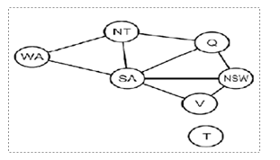

# AI-map-coloring-problem-python-solution

This is a  Solve of a map coloring problem using three colors ['red', 'green', 'blue'].

Q: Find all the combinations of assigning one of these colors to each territory.

Constraint: No territory can have the same color as any of its neighbors.

territory image:
https://bit.ly/3h3XxzY

